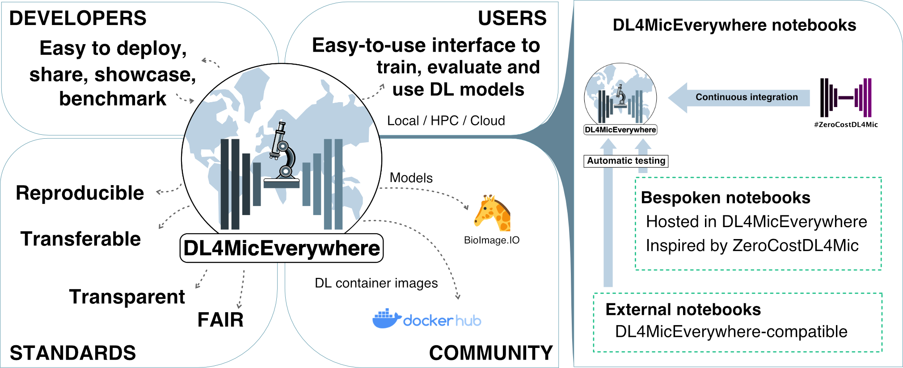

[](https://github.com/HenriquesLab/DL4MicEverywhere/blob/main/LICENSE.txt)
[](https://github.com/HenriquesLab/DL4MicEverywhere/graphs/contributors)
[](https://github.com/HenriquesLab/DL4MicEverywhere/)
[](https://github.com/HenriquesLab/DL4MicEverywhere/)


<!--


-->


# DL4MicEverywhere

DL4MicEverywhere is a platform that offers researchers an easy-to-use gateway to cutting-edge deep learning techniques for bioimage analysis. It features interactive Jupyter notebooks with user-friendly graphical interfaces that require no coding skills. 
The platform utilizes Docker [containers](https://hub.docker.com/repository/docker/henriqueslab/dl4miceverywhere) to ensure portability and reproducibility, guaranteeing smooth operation across various computing environments.

DL4MicEverywhere extends the capabilities of [ZeroCostDL4Mic](https://github.com/HenriquesLab/ZeroCostDL4Mic) by allowing the execution of notebooks either locally on personal devices like laptops or remotely on diverse computing platforms, including workstations, high-performance computing (HPC), and cloud-based systems. 
It currently incorporates numerous pre-existing ZeroCostDL4Mic notebooks for tasks such as segmentation, reconstruction, and image translation.

## Key Features

- 25+ Jupyter notebooks with a user-friendly graphical interface that requires no coding (scaling to 28+ soon).
- Docker-based [packaging](https://hub.docker.com/repository/docker/henriqueslab/dl4miceverywhere) for enhanced portability and reproducibility.
- Deploys the [ZeroCostDL4Mic](https://github.com/HenriquesLab/ZeroCostDL4Mic) user experience into local use.
- Supports a wide array of microscopy analysis tasks, including segmentation, reconstruction, registration, denoising, and more.
- Compatible with various computing environments, including laptops, workstations, HPC, and cloud with Docker.
- Automated build testing and versioning for improved reliability.
- [Watch a short description](https://www.youtube.com/watch?v=kRIAls6oT4k).



## Key benefits of DL4MicEverywhere

- **Flexibility:** Notebooks can run locally, in the cloud, or on high-performance computing infrastructure. No vendor lock-in.
- **Reproducibility:** Docker containers encapsulate the full software environment. Explicit versioning maintains stability.
- **Transparency:** Notebooks and models can be readily shared to enable replication of analyses.
- **Accessibility:** Interactive widgets and automated build pipelines lower barriers for non-experts.
- **Interoperability:** Adheres to data standards like BioImage Model Zoo for model sharing.
- **Extensibility:** Automated testing and Docker building streamline the addition of new methods.

DL4MicEverywhere is designed to make deep learning more accessible, transparent, and participatory. This enables broader adoption of advanced techniques while enhancing reliability and customization.

## What is a DL4MicEverywhere notebook?

- A DL4MicEverywhere notebook is designed to assist researchers in utilizing deep learning models for image processing.
- It is fully encapsulated within a Docker container, providing a controlled and versioned snapshot of the dependencies required for the notebook.
- The versions of the required libraries are controlled upstream and downstream of the Docker container.
- The notebook is validated using continuous integration (CI) workflows to ensure compatibility with MacOS, Windows, and Linux.
- It features a user-friendly interface similar to ZeroCostDL4Mic, allowing users to train the model, perform quality checks, and run inference on new data.
- The notebook is fully traceable and open source.

## Getting Started

[](https://youtu.be/d1FB_zc5gVc)

Reproduce the demo in the video with the `U-Net (2D) multilabel` notebook and [Bacillus subtilis segmentation data from DeepBacs](https://zenodo.org/records/5639253). Note that run time will vary from minutes to hours depending on the GPU availability and computing resources. 

Refer to the [Step-by-step "How to" guide](docs/USER_GUIDE.md) and [Requirements Installation Guidelines](docs/REQUIREMENTS_INSTALLATION.md) for further details.
### Requirements

- Docker Desktop installed ([download](https://www.docker.com/products/docker-desktop)).
- For GPU acceleration - NVIDIA GPU + CUDA drivers ([setup](https://docs.nvidia.com/cuda/)).
- For the graphical user interface (GUI),  [Tcl/Tk](https://www.tcl.tk/).

### Quickstart MacOS/Linux

1. Clone this repo: `git clone https://github.com/HenriquesLab/DL4MicEverywhere.git`
2. Navigate to the repo directory.
3. Run `sudo -E bash launch.sh` to launch the notebook selection GUI.
4. Choose a notebook and run!

### Quickstart Windows

> ⚠️: **IMPORTANT:**
> The GPU usage on Windows machines is not working at this moment due to some TensorFlow and NVIDIA compatibility issues. This issue is under development (alternatives like conda are considered [here](https://github.com/HenriquesLab/DL4MicEverywhere/tree/Pass-to-conda)) and discussed [here](https://github.com/HenriquesLab/DL4MicEverywhere/issues/24). 

1. Clone this repo: `git clone https://github.com/HenriquesLab/DL4MicEverywhere.git`
2. Navigate to the repo directory.
3. Run `wsl bash launch.sh` to launch the notebook selection GUI.
4. Choose a notebook and run!

With Docker, all dependencies are neatly bundled. Just launch and access deep learning workflows through an intuitive interface!


## Contributing

We welcome contributions! Please check out the [contributing guidelines](CONTRIBUTING.md) to get started.

## Documentation

- [Requirements Installation Guidelines](docs/REQUIREMENTS_INSTALLATION.md)
- [Step-by-step "How to" guide](docs/USER_GUIDE.md)
- [Remote Connection](https://github.com/HenriquesLab/DL4MicEverywhere/blob/main/docs/GUI_USER_GUIDE.md#connection-with-remote-workstations-through-ssh)
- Notebooks
  - [Notebook Types](docs/NOTEBOOK_TYPES.md)
  - [Notebook List](docs/NOTEBOOKS.md)
  - [Notebooks Folders](https://github.com/HenriquesLab/DL4MicEverywhere/tree/main/notebooks)
- [Docker Desktop](docs/DOCKER_DESKTOP.md)
- [DL4MicEverywhere Technical Design](docs/DESIGN.md)
- [Troubleshooting](docs/TROUBLESHOOTING.md)
- [FAQ](docs/FAQ.md)
- [Contributing Guidelines](CONTRIBUTING.md) 

Don't hesitate to reach out if you need any clarification!

## Acknowledgements

We extend our gratitude to the [ZeroCostDL4Mic](https://github.com/HenriquesLab/ZeroCostDL4Mic) contributors for their work on the original notebooks. We also thank the [AI4Life](https://ai4life.eurobioimaging.eu/) consortium for their support and continuous feedback.

## How to cite this work
 
_Iván Hidalgo-Cenalmor, Joanna W Pylvänäinen, Mariana G Ferreira, Craig T Russell, Ignacio Arganda-Carreras, AI4Life Consortium, Guillaume Jacquemet, Ricardo Henriques, Estibaliz Gómez-de-Mariscal.
**DL4MicEverywhere: Deep learning for microscopy made flexible, shareable, and reproducible. bioRxiv 2023**
DOI: [https://doi.org/10.1101/2023.11.19.567606](https://www.biorxiv.org/content/10.1101/2023.11.19.567606v1)_

[](https://doi.org/10.1101/2023.11.19.567606)
```
@article{hidalgo2023dl4miceverywhere,
  title={{DL4MicEverywhere}: {Deep} learning for microscopy made flexible, shareable, and reproducible},
  author={Hidalgo-Cenalmor, Iv{\'a}n and Pylv{\"a}n{\"a}inen, Joanna W and Ferreira, Mariana G and Russell, Craig T and Arganda-Carreras, Ignacio and AI4Life Consortium and Jacquemet, Guillaume and Henriques, Ricardo and G{\'o}mez-de-Mariscal, Estibaliz},
  journal={bioRxiv},
  pages={2023--11},
  year={2023},
  publisher={Cold Spring Harbor Laboratory}
}
```
